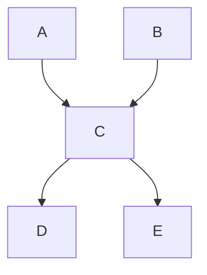
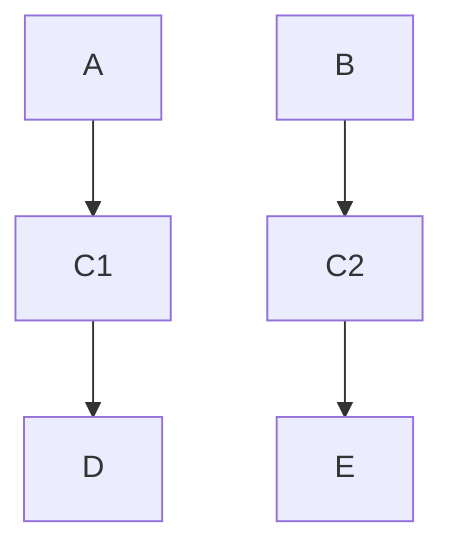

# 행렬 거듭 제곱

<aside>
💡 DP 점화식이 선형 방정식인 경우

</aside>

$
a_n = \sum_{k=1}^{m}{c_k*a_{n-k}}
$

위와 같은 형태의 점화식일 때 $O(m^3log(n))$ 에 n번째 항을 구할 수 있다. 

## 분할정복을 이용한 행렬 거듭제곱 $O(log(n))$

예를 들어 피보나치 수를 생각해보자

$$ \begin{bmatrix}
F_2 \\
F_1
\end{bmatrix} = \begin{bmatrix}
1 & 1 \\
1 & 0
\end{bmatrix} \begin{bmatrix}
F_1 \\
F_0
\end{bmatrix}, \begin{bmatrix}
F_3 \\
F_2
\end{bmatrix} = {\begin{bmatrix}
1 & 1 \\
1 & 0
\end{bmatrix}}^2\begin{bmatrix}
F_2 \\
F_1
\end{bmatrix} \dots $$


$$
\begin{bmatrix}
F_n \\
F_{n-1}
\end{bmatrix} = {\begin{bmatrix}
1 & 1 \\
1 & 0
\end{bmatrix}}^{n-1}\begin{bmatrix}
F_{n-1} \\
F_{n-2}
\end{bmatrix}
$$

이렇게 정리할 수 있다. 

## 그래프의 이동 경로 경우의 수

$$
ADJ= \begin{bmatrix}
0 & 1 & 1 \\
1 & 0 & 1 \\
1 & 1 & 0\end{bmatrix}
$$

인접 행렬이 이런 식으로 되어 있다면 삼각형을 떠올릴 수 있다. 

$$
{\begin{bmatrix}
0 & 1 & 1 \\
1 & 0 & 1 \\
1 & 1 & 0\end{bmatrix}}^2 =  \begin{bmatrix}
2 & 1 & 1 \\
1 & 2 & 1 \\
1 & 1 & 2\end{bmatrix}
$$

제곱 한 결과는 2번 이동했을 때 1번 정점에 다시 돌아 오는 경우는 2개, 1→2는 1가지, 1→3은 1가지 이런식이다. 

3번 이동한 결과는 어떻게 될까

$$
{\begin{bmatrix}
0 & 1 & 1 \\
1 & 0 & 1 \\
1 & 1 & 0\end{bmatrix}}^3 =  \begin{bmatrix}
2 & 3 & 3 \\ 3 & 2  &3 \\ 3 &3 & 2\end{bmatrix}
$$

3번 이동했을 때 다시 제자리로 오려면 한쪽 방향으로 쪽 가면 되니까 2가지

나머지 경우는 뒤를 -1 앞을 1이라고 하면 {-1, 1, 1} ,  {1, -1, 1}, {1, 1,- 1} 이런식으로 3가지 방식이 있다. 

**중요한 것은** 

<aside>
💡 행렬 제곱을 하면 한 정점에서 다른 정점까지 가는 경우의 수를 알 수 있다.

</aside>

### [12850 본대산책2](https://www.acmicpc.net/problem/12850)

각 정점을 숫자는 알아서 설정하고 인정행렬을 만든다. 

그리고 제곱을 한뒤에 $matrix[과학관정점][과학관정점]$ 을 하면 답이다. 

시간 복잡도는 $O(8^3log(D))$로 풀 수 있을 것이다. 

아래가 코드이다. 

```cpp
#include <bits/stdc++.h>
#define fast_io cin.tie(NULL); ios_base::sync_with_stdio(false);
using namespace std;
typedef long long ll;
typedef pair<int, int> pii;
typedef pair<ll, ll> pll;
typedef tuple<int, int, int> tiii;
#define xx first
#define yy second

const ll MOD = 1e9+7;
class matrix{
public:
    vector<vector<ll>> mat;
    
    void initialize(int a, int b){
        mat.assign(a, vector<ll>(b,0));
    }
    
    void input(){
        mat = { {0, 1, 1, 0, 0, 0, 0, 0},
                {1, 0, 1, 1, 0, 0, 0, 0},
                {1, 1, 0, 1, 1, 0, 0, 0},
                {0, 1, 1, 0, 1, 1, 0, 0},
                {0, 0, 1, 1, 0, 1, 1, 0},
                {0, 0, 0, 1, 1, 0, 0, 1},
                {0, 0, 0, 0, 1, 0, 0, 1},
                {0, 0, 0, 0, 0, 1, 1, 0},
        };
    }
    
    matrix operator*(matrix A){
        matrix result;
        result.initialize(mat.size(), A.mat[0].size());
        for(int i=0;i<mat.size();i++){
            for(int j=0;j<A.mat[0].size();j++){
                for(int k=0;k<A.mat.size();k++){
                    result.mat[i][j] += mat[i][k]*A.mat[k][j];
                    result.mat[i][j] %= MOD;
                }
            }
        }
        return result;
    }
    
};

matrix mat;

matrix powMat(matrix &mat, ll b){
    if(b==1){
        return mat;
    }
    
    matrix half = powMat(mat, b/2);
    matrix ret = (half*half);
    if(b&1) return ret*mat;
    return ret;
}

int main(){
    fast_io
    ll D; cin >> D;
    mat.input();
    matrix res = powMat(mat, D);
    cout << res.mat[0][0];
}
```

### [1533 길의 개수](https://www.acmicpc.net/problem/1533)

이 문제는 인접행렬에 가중치가 있다. 

그래서 단순히 가중치를 포함하여 경우의 수를 구할 수는 없다. 

그러면 아까 풀었던 문제로 치환 해야하는데 가중치를 없는 것 처럼 만드는 방법은 가중치만큼 반복하는 것이다. 

예를 들어 

$$
\begin{bmatrix}
0 & 1 & 2 \\
1 & 0 & 1 \\
1 & 2 & 0\end{bmatrix}
$$

1. 다음과 같은 행렬이 있으면 1→3까지 가는데 2분이 걸린다. 
2. 그럼 1분후 다른 정점에 들렀다가
3. 다시 1분후 원래 목적지에 도착한다. 

이런 식으로 푼다면 1가지 경우의 수로 목적지에 잘 도착하되, 1분단위로 계산할 수 있게 되었다. 

시간의 범위는 5이내 이니까 n개의 정점 이외 4개의 정점을 만들었다. n+1, n+2, n+3, n+4

만약에 시간이 3분 걸리면 n+3로 간다. (src → n+3 → n+4 → dest)

화살표가 3개있으니까 3분 걸리는게 맞다. 

**근데 이대로 구현하니까 값이 더 크게 나왔따. (틀렸단 뜻)**





위 와 같은 그래프가 있다고 하면 당연히 경로의 수는 왼쪽은 4가지, 오른쪽은 2가지가 된다. 

그리고 우리가 찾고 싶은 경로는 오른쪽이다. 그러면 각 정점마다 경유지를 설정해야한다는 뜻이다. 

그러면 정점이 총 $N + 4*N = 5N$ 개가 있을 것이다. 

시간복잡도는 $O((5N)^3log(T))$ 로 해결할 수 있다. 

예를 들어, A번 정점에서 B번정점으로 가는데 시간이 2걸린다고 치자. 그러면 A에서 출발하여 B번 정점의 4번 경유지를 들렀다가가면 B까지는 2걸릴 것이다. 이 아이디어가 가장 중요하다. 

```cpp
#include <bits/stdc++.h>
#define fast_io cin.tie(NULL); ios_base::sync_with_stdio(false);
using namespace std;
typedef long long ll;
typedef pair<int, int> pii;
typedef pair<ll, ll> pll;
typedef tuple<int, int, int> tiii;
#define xx first
#define yy second

const ll MOD = 1e6+3;
class matrix{
public:
    vector<vector<ll>> mat;
    
    void initialize(int a, int b){
        mat.assign(a, vector<ll>(b,0));
    }
    
    void input(int n, int m){
        mat = vector (5*n+1, vector<ll>(5*m+1));
        for(int i=5;i<=5*n;i+=5){
            for(int j=4;j>0;j--){
                mat[i-j][i-j+1] = 1;
            }
        }
        
    }
    
    matrix operator*(matrix A){
        matrix result;
        result.initialize(mat.size(), A.mat[0].size());
        for(int i=0;i<mat.size();i++){
            for(int j=0;j<A.mat[0].size();j++){
                for(int k=0;k<A.mat.size();k++){
                    result.mat[i][j] += mat[i][k]*A.mat[k][j];
                    result.mat[i][j] %= MOD;
                }
            }
        }
        return result;
    }
    
};

matrix mt;

matrix powMat(matrix &mat, ll b){
    if(b==1){
        return mat;
    }
    
    matrix half = powMat(mat, b/2);
    matrix ret = (half*half);
    if(b&1) return (ret*mat);
    return ret;
}

int main(){
    fast_io
    ll n, S, E, T;
    cin >> n >> S >> E >> T;
    mt.input(n, n);
    for(int i=1;i<=n;i++){
        string s; cin >> s;
        for(int j=1;j<=s.size();j++){
            int t = s[j-1]-'0';
            if(t){
                if(t==1){
                    mt.mat[5*i][5*j] = 1;
                }else{
                    mt.mat[5*i][5*j-t+1] = 1;
                }
            }
        }
    }
    matrix res = powMat(mt, T);
    cout << res.mat[5*S][5*E];
}
```

### [12728 n제곱 계산](https://www.acmicpc.net/problem/12728)

그러면 좀 어려운 문제를 풀어 볼 것이다. 

$(3 + \sqrt(5))^n$의 소숫점 앞에 마지막 세자리를 구하는 문제이다. (정수부를 1000으로 나눈 나머지)

$a = (3 + \sqrt(5))$, $b = (3 - \sqrt(5))$ 라고 해보자 

- $a + b = 6, ab = 4$ 이다.
- 위 두개를 보면 $a, b$ 는$x^2-6x+4$의 2개의 해이다.
- 따라서 $a^2 = 6a-4, b^2 = 6b-4$로 나타낼 수 있다.

다시 돌아와서 $(3 + \sqrt(5))^n$ 의 정수부는 어떻게 구할까?

먼저, $a^n + b^n$을 생각해보자. 이는 $6a^{n-1}-4a^{n-2} + 6b^{n-1}-4b^{n-2}$ 로 나타낼 수 있따.  이를 점화식 처럼 생각해보면

$f_n = 6f_{n-1}-4f_{n-2}$ $(f_1 = a+b = 6, f_2 = (a+b)^2-2ab= 28)$ 이다. 

여기서 우리는 선형방정식을 하나 구한 것이다.  그리고 $a^n + b^n$이 정수라는 것도 알아냈다. 

그런데 이 식이 문제랑 무슨 상관이냐고 생각이 될 수도 있다. 우리는 $a^n$만 필요한데…

근데 $b^n$을 가만히 생각해보면 $0< b_n ≤ 1$ 이라는 것을 알 수 있다.  즉…이것은 소수정도 수준이라는 것이다. 

즉, $a^n$에서 1보다 작은 수 $b^n$을 더했더니 $a^n + b^n$가 정수가 되었다. → $a^n+b^n-1$ 이 답이다. 

그러면 이제 아까 구했던 선형 방정식의 해를 구해 보자. 

$$\begin{bmatrix}
f_{n} \\
f_{n-1} \\
\end{bmatrix} = \begin{bmatrix}
f_{n-1} \\
f_{n-2} \\
\end{bmatrix}\begin{bmatrix}
6 & -4 \\
1 & 0 \\
\end{bmatrix} = \begin{bmatrix}
f_{2} \\
f_{1} \\
\end{bmatrix}{\begin{bmatrix}
6 & -4 \\
1 & 0 \\
\end{bmatrix}}^{n-2}$$

이를 구하고 $(1, 1)요소 * f_2(28) + (1, 2)요소 * f_1(6)-1$을 1000으로 나누면 답이다. 

이때 음수를 나오지 않게하기위해서 -4에 1000을 더해준다. 

```cpp
#include <bits/stdc++.h>
#define fast_io cin.tie(NULL); ios_base::sync_with_stdio(false);
using namespace std;
typedef long long ll;
typedef pair<int, int> pii;
typedef pair<ll, ll> pll;
typedef tuple<int, int, int> tiii;
#define xx first
#define yy second

const ll MOD = 1e3;
class matrix{
public:
    vector<vector <ll> > mat;
    
    void initialize(int a, int b){
        mat.assign(a, vector<ll>(b,0));
    }
    
    void input(){
	//어짜피 1000으로 나누니까 음수 부분을 없애버린다. 
        mat = { {6, -4+MOD}, {1, 0} };
    }
    
    matrix operator*(matrix A){
        matrix result;
        result.initialize(mat.size(), A.mat[0].size());
        for(int i=0;i<mat.size();i++){
            for(int j=0;j<A.mat[0].size();j++){
                for(int k=0;k<A.mat.size();k++){
                    result.mat[i][j] += mat[i][k]*A.mat[k][j];
                    result.mat[i][j] %= MOD;
                }
            }
        }
        return result;
    }
    
};

matrix mt;

matrix powMat(matrix &mat, ll b){
    if(b==0){// 단위 벡터 리턴
        matrix ret; ret.mat = { {1, 0}, {0, 1} };
        return ret;
    }
    if(b==1){
        return mat;
    }
    
    matrix half = powMat(mat, b/2);
    matrix ret = (half*half);
    if(b&1) return (ret*mat);
    return ret;
}

int main(){
    fast_io
    int tt; cin >> tt;
    int ori = tt;
    while (tt--) {
        ll n; cin >> n;
        mt.input();
        matrix res = powMat(mt, n-2);
        ll ans = (res.mat[0][0]*28+res.mat[0][1]*6-1)%MOD;
        string ANS = to_string(ans);
        cout << "Case #" << ori-tt << ": ";
        for(int i=ANS.size();i<3;i++) cout << '0';
        cout << ANS << '\n';
    }

}
```
